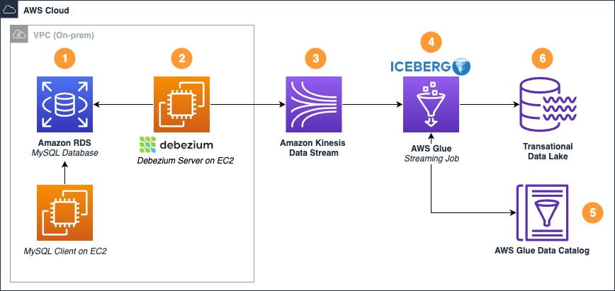

# DebeziumServer-Kinesis-CDC
## Overview
Guide to implement a CDC Pipeline using [Debezium Server](https://debezium.io/documentation/reference/2.0/operations/debezium-server.html) and [Amazon Kinesis](https://aws.amazon.com/kinesis) Integration.

This guide is part of a AWS Blogpost, intended to explain how Debezium Server can be used as an alternative solution for CDC.
Access the blogpost here. 

### Architecture
<p align="center">

</p>

Resources provisioned with the Cloudformation Stack:
1. **Database instance**: We are going to use this resource as the source datasource for our CDC stream. It is a MySQL Database. The template also provisiones a MySQL Client EC2 Instance so we can connect securely to our Database. 
2. **Debezium Server**: We are going to use a EC2 Instance to host the Debezium Server Application. This can be hosted on-premisses or on AWS. We are provisioning a VPC to simulate a on-premisses network.
3. **Kinesis Data Stream**: Debezium Server can write CDC data to KDS natively. We are going to create a stream on Kinesis to receive updates, inserts and deletes data. 

Others resources covered by the solution (provisioned on the step by step):

4. **AWS Glue Streaming Job**: We are going to usa a Notebook as a Glue Streaming Job to proccess the cdc data and deliver the update, insert and deletes operations to our Data Lake. 

5. **AWS Glue Data Catalog**: Catalogs the Schema from the Data Lake to be used on our streaming job. 

6. **Transational Data Lake**: Data is delivered to the data lake. 

### Getting Started

Pre-requisites:
* [Clone/Download the repository](https://docs.github.com/en/github/creating-cloning-and-archiving-repositories/cloning-a-repository); 
* [AWS Account](https://aws.amazon.com/premiumsupport/knowledge-center/create-and-activate-aws-account/); 
* [AWS CLI](https://docs.aws.amazon.com/cli/latest/userguide/install-cliv2.html); 
* [Setup CLI credentials](https://docs.aws.amazon.com/cli/latest/userguide/cli-configure-quickstart.html#cli-configure-quickstart-config);
* Run the demonstration on the **us-east-2** region 

### [AWS CloudFormation](https://aws.amazon.com/cloudformation/)

In this repository we have one [AWS CloudFormation](https://aws.amazon.com/cloudformation/) Template that we are going to use to provision the stack.
Download the [Cloudformation Template](cloudformation/DebeziumServer-Kinesis-CDC.json) and deploy it on your AWS account.

To deploy the stack using the AWS CLI:
After you´ve cloned the repository on your machine, run: 
``` bash
aws cloudformation create-stack --stack-name debezium-demo-stack --template-body file://cloudformation/DebeziumServer-Kinesis-CDC.json --parameters ParameterKey=KeyPairName,ParameterValue=<KEY_PAIR> ParameterKey=YourIPAddress,ParameterValue=<YOUR_IP_ADDRESS> ParameterKey=DBmasterusername,ParameterValue=<DB_MASTER_USER_NAME> ParameterKey=DBmasteruserpassword,ParameterValue=<DB_MASTER_USER_PASSWORD> --capabilities CAPABILITY_NAMED_IAM
```

**Values to be replaced:**

* **<KEY_PAIR>** - The name of the Key Pair you want to use to ssh your EC2 (do not add the extension .pem)
* **<YOUR_IP_ADDRESS>** - You're IP Address, to access the EC2 Instances. Use the format 0.0.0.0/32. To find out you IP go to: https://www.google.com/search?q=what+is+my+ip+address
* **<DB_MASTER_USER_NAME>** - The master username to connect to the MySQL DB
* **<DB_MASTER_USER_PASSWORD>** - The password to connect to the MySQL DB.Must have 8 characteres at least.

Wait the stack status to be **CREATE_COMPLETE**. 

Follow the step by step provided on the [AWS Blogpost](linkdomeublog) to test the solution. 

## Security

See [CONTRIBUTING](CONTRIBUTING.md#security-issue-notifications) for more information.

## License

This library is licensed under the MIT-0 License. See the LICENSE file.
